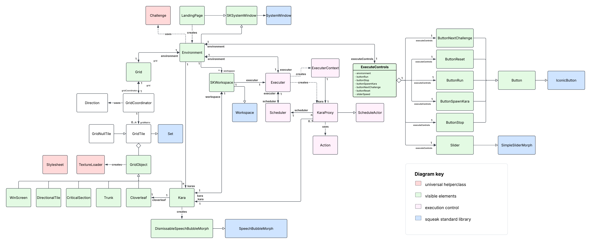

# SqueakKara 🐞
When you want coding to be as simple as collecting a cloverleaf. 

## How To Use 🍀

To start the game, open a workspace and run 'SKLandingPage new.'. Then you can select a new project or a level from the LandingPage and start playing!

You see it opened multiple windows. One SKGrid and for each Kara one SKWorkspace in the same color. 

You have 2 options to execute code: either you use the *"Do It!"* or the *"Print It!"* commands in the newly opened SKWorkspace for instant feedback. OR you write full code in the SKWorkspace, **save the code** and use the **execute controls** above the SKGrid. When you use the **execute controls** all Karas execute simultaniantly. With the **execute controls** you can pause the execution, stop the execution, adjust the speed of exection, spawn new Karas and reset the Level.


## What to do 🎱

When you just want to experiment open a blank project. You can spawn new Karas by clicking the Kara-Button in the **execute controls** section.

To solve problems open one of the example projects. In each level you have to move each Kara to its own Cloverleaf and collect it with collect Cloverleaf. Aside from trees there are different challenges with additional components: some direktional fields, marked with arrows, can only be entered from these directions; other fiels are marked with stripes and only one Kara can be in this area at a time, when one Kara is inside the stripes turn from green to red indicating no additional Kara can enter. After compleating a level you can progress to the next with the continue Button.

To add your own projects you can modify the challenge functions in the SKGrid and the SKEnvironment class. 

## Hints 💡

Kara has following methods you can use:
  - move
  - turn: left/right
  - collectCloverleaf
  - trunkAhead
  - onCloverleaf

And remember to use Squeak Syntax.

### Example Code for "Example Project 1" 👨‍💻

```squeak
[kara onCloverleaf not]
	whileTrue: [
		kara trunkAhead 
			ifTrue: [kara turn: right]
			ifFalse: [kara move]].
kara collectCloverleaf
```

You can use the slider in the middle to change the speed of the code execution.

If you have moved Kara in a tricky spot you can always change its position in the grid via the Squeak Halo.

You might run code by using the "do it" command `CTRL+D`. If you find yourself stuck in an infinite loop (Squeak might get unresponsive), just press `ALT+.` to interrupt the code execution.

## Architecture 🌇



The LandingPage opens the Environment, which consists of the Grid, Workspace and the Executer. The grid owns every object and allows interactions between them. The workspace owns Kara and allows the do-it and print-it-statements. 

You can write code in the Workspace and execute it with the executer through the execute commands above the grid. There you can start, pause and terminate a process and toggle the speed. The executer uses a Kara decorator to allow stepping through the code. 

